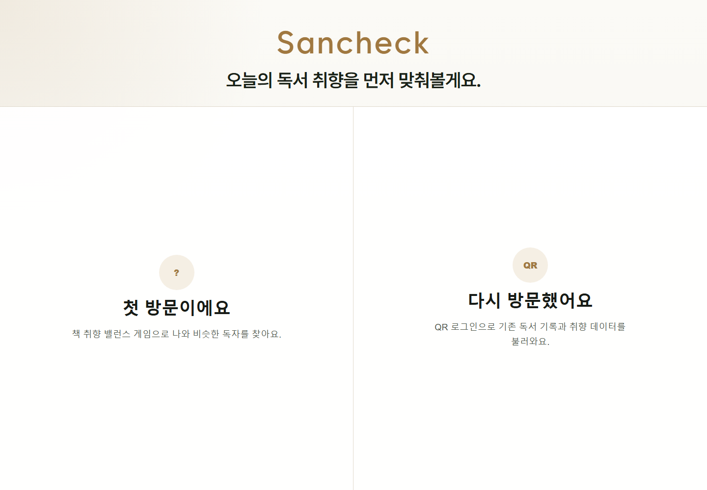
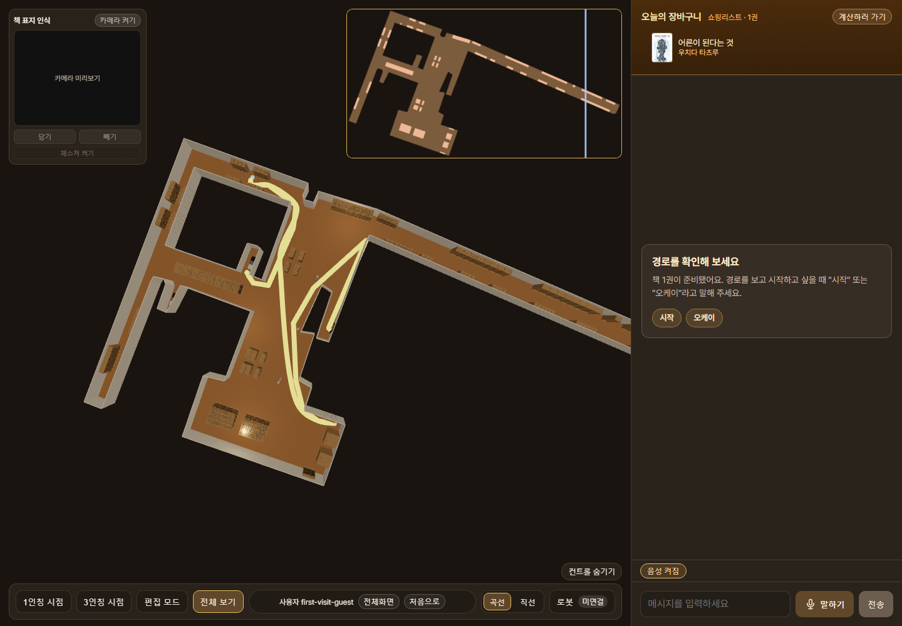
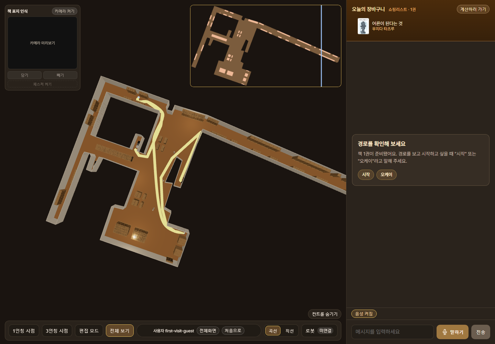
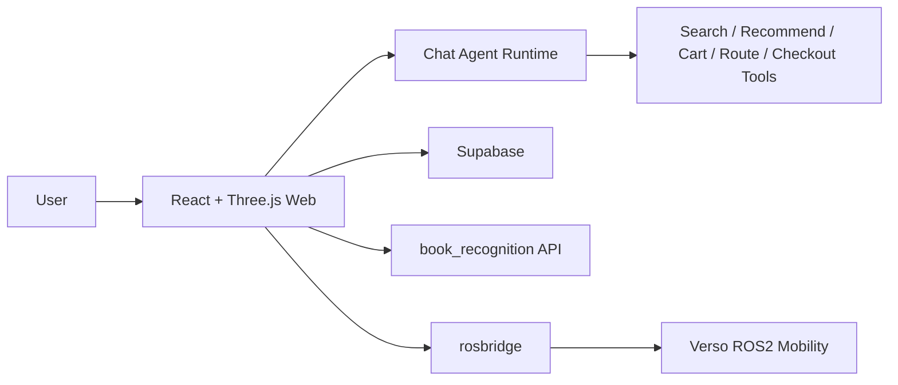

# 산책 Sanchaek

> SLAM 지도를 3D 서점 경험으로 확장한 AI 도서 탐색·로봇 안내 웹 서비스

| Onboarding | 3D Bookstore Map | AI Shopping Guide |
|---|---|---|
|  |  |  |

## 프로젝트 소개

산책은 실제 서점 공간을 SLAM으로 스캔한 뒤, 그 지도를 웹 기반 3D 서점으로 재구성하는 프로젝트입니다. 사용자는 첫 방문 여부와 독서 취향을 입력하고, 비슷한 독자의 책을 담은 뒤, 3D 공간 안에서 책장 위치와 이동 경로를 확인할 수 있습니다.

단순한 3D 뷰어가 아니라 “책을 발견하고, 담고, 길 안내를 받는” 현장 경험을 목표로 설계했습니다. 웹 화면에서는 AI 채팅 에이전트가 책 검색, 추천, 장바구니 관리, 경로 안내, 계산대 이동 요청을 처리하고, 별도 ROS2 패키지에서는 Verso 이동체와 연결되는 실험 코드를 함께 다룹니다.

## 핵심 사용자 경험

1. 첫 방문자는 취향 밸런스 게임으로 독서 성향을 만들고, 재방문자는 QR 로그인으로 기존 기록을 불러옵니다.
2. 취향이 비슷한 독자 프로필과 추천 도서를 확인하고, 오늘 둘러볼 책을 장바구니에 담습니다.
3. SLAM 기반 3D 서점 지도에서 책장, 통로, 계산대, 추천 경로를 확인합니다.
4. 채팅 에이전트에게 책 검색, 추천, 책 담기/빼기, 경로 안내, 계산대 이동을 요청합니다.
5. 로봇 연동 환경에서는 rosbridge를 통해 Verso 이동체의 안내·정지·재개 명령으로 확장할 수 있도록 설계했습니다.

## 주요 기능

| 영역 | 구현 내용 |
|---|---|
| 3D 지도 | SLAM 맵 데이터를 바닥, 벽, 기둥, 책장으로 변환해 React Three Fiber Canvas에 렌더링 |
| 탐색 UI | 전체 보기, 1인칭 시점, 3인칭 시점, 편집 모드 전환과 WASD 이동 |
| 책장 렌더링 | 책장 후보 배치, 책장 내부 책 오브젝트, InstancedMesh 기반 렌더링 최적화 |
| AI 채팅 | intent parser와 LLM planner/reply를 조합한 책 검색·추천·장바구니·경로 도구 실행 |
| 데이터 연동 | Supabase 기반 도서 검색, 장바구니, QR 로그인, 구매/영수증 흐름 |
| 책 표지 인식 | 로컬 `book_recognition` API와 브라우저 캡처 UI를 연결하는 브리지 |
| 로봇 연동 | rosbridge WebSocket으로 Verso ROS2 패키지에 명령과 웨이포인트를 전달하는 실험 구조 |

## AI & Agent

산책의 채팅 에이전트는 자연어 입력을 바로 LLM에만 맡기지 않고, 규칙 기반 intent parser와 LLM planner를 함께 사용합니다. 명확한 “책 추가”, “삭제”, “계산대 가기” 같은 요청은 로컬 정책으로 우선 처리하고, 추천이나 대화형 응답은 LLM 결과를 도구 호출과 합쳐 실행합니다.

주요 도구는 `bookSearchTool`, `recommendationTool`, `shoppingListTool`, `routePlannerTool`, `checkoutTool`, `mobilityControlTool`로 나뉩니다. 이 구조 덕분에 채팅 UI는 한 문장 대화처럼 보이지만, 내부적으로는 검색, 추천, 장바구니 변경, 지도 경로 표시, 로봇 명령 발행을 분리해 추적할 수 있습니다.

## 기술적 구현 포인트

- **SLAM 맵 파이프라인**: PGM/YAML 기반 지도 정보를 `scripts/processMap.mjs`로 변환하고, `src/data/mapData.ts`와 `floorPlan.ts`에서 3D 렌더링용 좌표와 보정 데이터를 관리합니다.
- **3D 성능 최적화**: 반복되는 기둥·책장·책 오브젝트는 InstancedMesh로 묶고, 지도 전체는 Canvas 위에서 시점별 UI 레이어와 분리했습니다.
- **책장 배치와 충돌 처리**: 벽면 스냅, 복도 양쪽 책장 정렬, 회전 책장 AABB 변환, 플레이어 반경 기반 충돌 감지를 별도 유틸로 분리했습니다.
- **Supabase 연동**: QR 로그인, 책 검색, 장바구니/구매 흐름을 웹 클라이언트에서 다루며, 실패 시 UI 메시지로 상태를 노출합니다.
- **책 인식 실험**: Python 로컬 모듈에서 ORB 표지 매칭과 알라딘 API 메타데이터 보강을 실험하고, 웹에서는 `/book-recognition` 브리지로 연결합니다.
- **ROS2/rosbridge 구조**: `Verso_mobility`의 ROS2 노드가 웹에서 받은 명령, 웨이포인트, 상태 이벤트를 이동체 제어 흐름과 연결하도록 구성했습니다.

## Architecture

## 현재 구현 상태

| 상태 | 내용 |
|---|---|
| 구현 완료 | 3D 서점 지도, 책장 렌더링/편집, 시점 전환, 경로 시각화, 채팅 에이전트 도구 구조, QR 로그인 UI, 장바구니/계산 흐름 UI |
| 부분 연동·로컬 데모 | Supabase 도서 데이터 연동, OpenAI 기반 응답 생성, `book_recognition` 표지 인식 API, MediaPipe 제스처 데모, rosbridge 명령 전달 |
| 설계·개발 중 | 운영 환경의 실제 로봇 주행 검증, 자동 책장·기둥 감지 완성, 책 인식과 3D 탐색 흐름의 완전한 통합, 상용 수준의 전체 서비스 플로우 |

산책은 완성된 상용 서비스라기보다, 공간 인식 지도와 도서 추천 경험, 이동체 안내를 하나의 사용자 흐름으로 묶어 본 프로토타입입니다. 특히 “지도 데이터를 어떻게 사람이 이해할 수 있는 매장 경험으로 바꿀 것인가”와 “AI 에이전트가 실제 UI·지도·로봇 명령으로 이어지게 하려면 어떤 구조가 필요한가”에 초점을 맞췄습니다.
