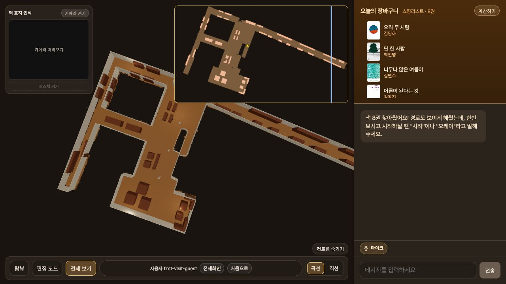
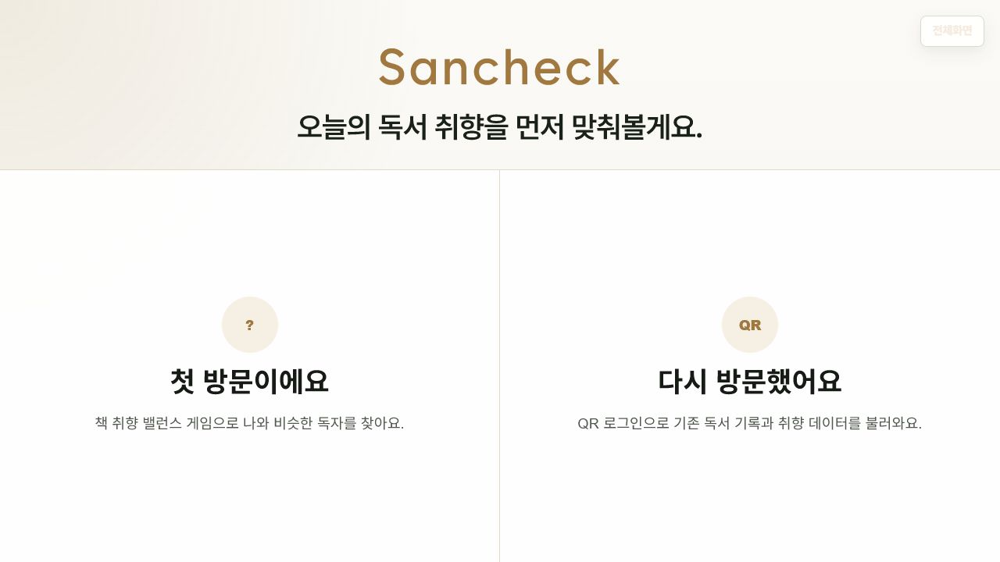
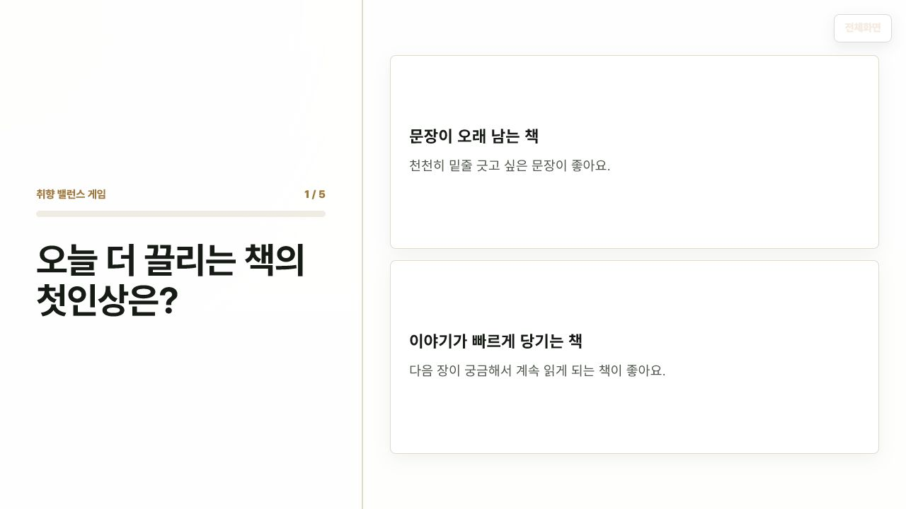
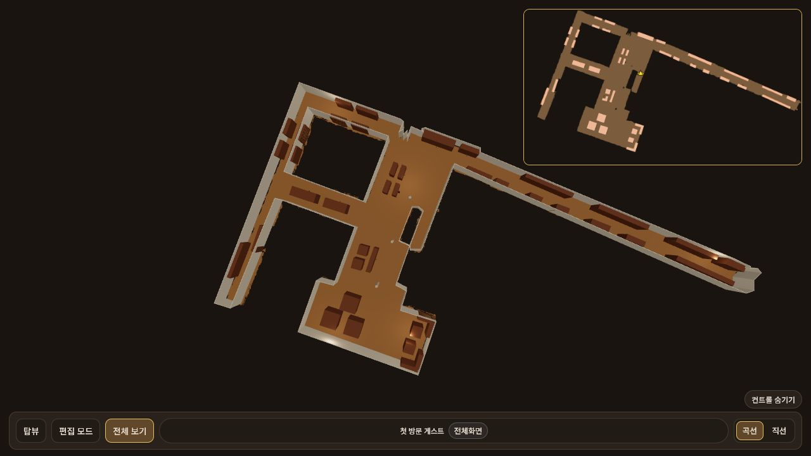
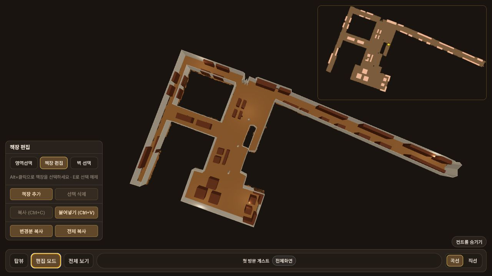
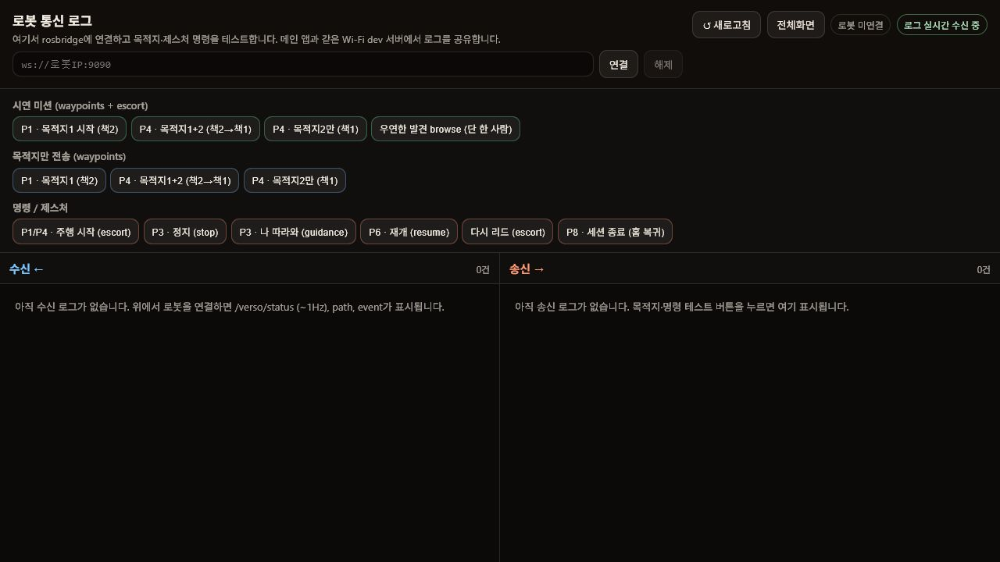
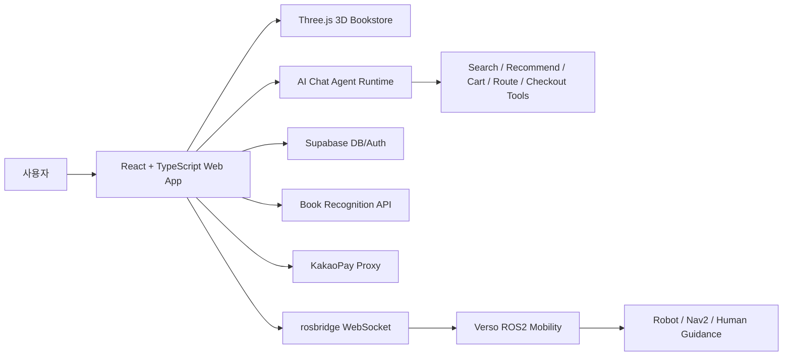

# 산책 Sanchaek

> SLAM 지도를 3D 서점 경험으로 확장한 AI 도서 탐색·로봇 안내 웹 서비스




> 현재 저장소에는 GIF 대신 대표 스크린샷을 사용했습니다. 시연 GIF가 준비되면 위 이미지를 GIF로 교체하면 됩니다.

--------------------------------

## 프로젝트 개요

- **기간**: 2026.03 ~ 2026.06
- **인원**: 1명
- **역할**: 프론트엔드 개발, 3D 지도 구현, AI 채팅 에이전트 설계, Supabase 연동, 책 표지 인식 API 브리지, ROS2 로봇 연동 프로토타입 구현

산책은 실제 서점 공간을 SLAM으로 스캔한 뒤, 웹 기반 3D 서점으로 재구성한 프로젝트입니다. 사용자는 취향 기반 추천 도서를 장바구니에 담고, 3D 지도에서 책장 위치와 이동 경로를 확인하며, AI 채팅 에이전트에게 도서 검색·추천·길 안내·결제 이동을 요청할 수 있습니다.

--------------------------------

## 프로젝트 배경

오프라인 서점은 책을 직접 발견하는 즐거움이 있지만, 원하는 책의 위치를 찾거나 취향에 맞는 책을 빠르게 탐색하기 어렵습니다. 특히 대형 서점에서는 책장 위치, 추천 흐름, 동선 안내가 분리되어 있어 사용자가 여러 단계를 직접 오가야 합니다.

이 프로젝트는 "서점 공간 자체를 인터랙티브한 탐색 경험으로 만들 수 있을까?"라는 질문에서 시작했습니다. SLAM 지도 데이터를 단순 평면 지도가 아니라 3D 공간으로 변환하고, AI 에이전트와 로봇 안내를 연결해 사용자가 책을 고르고 찾아가는 흐름을 하나의 서비스로 설계했습니다.

--------------------------------

## 핵심 기능

| 방문 선택 | 취향 밸런스 게임 | 추천 독자·도서 |
|---|---|---|
|  |  |  |

| 메인 지도·채팅 | 3D 지도 단독 | 책장 편집 모드 |
|---|---|---|
|  |  |  |

| QR 재방문 로그인 | 로봇 연동 로그 |
|---|---|
|  |  |

### 1. 취향 기반 온보딩

- 첫 방문자는 밸런스 게임 형태의 질문을 통해 독서 취향을 입력합니다.
- 재방문자는 QR 로그인으로 기존 세션과 장바구니 정보를 불러올 수 있습니다.
- 비슷한 독자 프로필과 추천 도서를 보여주고, 사용자가 오늘 둘러볼 책을 선택하도록 구성했습니다.

### 2. SLAM 기반 3D 서점 지도

- PGM/YAML 기반 SLAM 지도와 보정 데이터를 바닥, 벽, 기둥, 책장 오브젝트로 변환했습니다.
- React Three Fiber와 Three.js로 전체 보기, 1인칭, 3인칭, 편집 모드를 제공합니다.
- WASD 이동, 책장 충돌 처리, 미니맵, 추천 경로 시각화를 통해 실제 매장을 걷는 듯한 탐색 경험을 구현했습니다.

### 3. AI 채팅 에이전트

- 사용자의 자연어 요청을 책 검색, 추천, 장바구니 수정, 경로 안내, 계산대 이동 도구로 연결합니다.
- 명확한 명령은 로컬 intent parser와 정책으로 처리하고, 추천·대화 응답은 LLM planner/reply와 조합했습니다.
- 채팅은 단순 답변 UI가 아니라 3D 지도와 장바구니 상태를 실제로 바꾸는 실행 인터페이스로 동작합니다.

### 4. 책 표지 인식 및 결제 흐름

- 로컬 `book_recognition` API에서 ORB 기반 표지 매칭과 알라딘 API 메타데이터 보강을 실험했습니다.
- 웹에서는 카메라 캡처 UI와 식별 API 프록시를 연결할 수 있도록 브리지를 구성했습니다.
- KakaoPay QR 모달과 Supabase 구매 기록 흐름을 통해 계산대 이동 이후의 결제 시나리오까지 확장했습니다.

### 5. ROS2 로봇 안내 연동

- rosbridge WebSocket을 통해 웹에서 Verso 이동체로 목적지, 모드, 정지, 재개, 세션 종료 명령을 전달하는 구조를 만들었습니다.
- `Verso_mobility` 패키지에는 Nav2 기반 주행, 사람 추종, 충돌 모니터링, 웹 브리지 노드가 포함되어 있습니다.
- 실제 로봇 검증 전에도 Mock backend와 로그 모니터 페이지로 웹-로봇 프로토콜을 테스트할 수 있게 했습니다.

--------------------------------

## 시스템 아키텍처



--------------------------------

## 기술 스택

| 분류 | 기술 |
|---|---|
| Frontend | React 19, TypeScript, Vite |
| 3D Rendering | Three.js, React Three Fiber, Drei |
| 상태·도메인 로직 | React Hooks, TypeScript 유틸 모듈, Zod |
| AI Agent | OpenAI API 연동 구조, intent parser, tool registry |
| Database | Supabase, PostgreSQL schema/migration |
| 결제 | KakaoPay API proxy, QR modal |
| 책 인식 | Python, OpenCV ORB 매칭, Aladin API, 로컬 식별 API |
| 로봇 연동 | ROS2, Nav2, rosbridge WebSocket, Python ROS nodes |
| 테스트 | Vitest, Testing Library, jsdom |
| 품질 관리 | ESLint, TypeScript build, 커스텀 검증 스크립트 |

--------------------------------

## 담당한 개발

### 1. SLAM 지도를 3D 서점으로 변환

- 실제 매장 SLAM 데이터를 웹에서 사용할 수 있는 좌표계와 렌더링 데이터로 변환했습니다.
- 바닥, 벽, 기둥, 책장, 통로를 별도 데이터로 분리하고 3D 공간에서 일관된 비율로 렌더링했습니다.
- 지도 좌표와 로봇 좌표가 서로 어긋나지 않도록 `robotMapCoords`, `robotMissionCoords`, `buildMissionWaypoints` 유틸을 분리했습니다.

### 2. 3D 탐색 UX와 책장 편집 기능

- 전체 보기, 1인칭, 3인칭, 편집 모드를 구현하고 각 모드에 맞는 카메라 제어를 분리했습니다.
- 책장 배치 후보를 검토하기 위해 마우스 드래그, 회전, 복사/붙여넣기, 벽면 정렬 기능을 제공했습니다.
- 반복되는 책장과 책 오브젝트는 InstancedMesh를 활용해 렌더링 비용을 줄였습니다.

### 3. AI 에이전트와 도구 실행 구조

- 자연어 요청을 바로 UI 텍스트로만 처리하지 않고, 도구 호출 단위로 분해했습니다.
- `bookSearchTool`, `recommendationTool`, `shoppingListTool`, `routePlannerTool`, `checkoutTool`, `mobilityControlTool`을 분리해 검색·추천·경로·결제·로봇 명령을 추적 가능하게 만들었습니다.
- 오프토픽 응답, 확인 카드, 중복 메시지 제거, 진행 토큰 등 대화형 UI에서 발생하는 예외 상황을 별도 테스트로 관리했습니다.

### 4. 외부 서비스와 로봇 프로토콜 연동

- Supabase 기반 QR 로그인, 도서 데이터, 장바구니, 구매 흐름을 구성했습니다.
- KakaoPay와 책 표지 인식 API는 Vite 개발 서버 플러그인과 로컬 프록시 서버로 분리해 브라우저 보안 제약을 우회했습니다.
- ROS2 로봇과의 통신은 rosbridge client, command bridge, mock backend, 로그 스토어로 나누어 실제 로봇 없이도 웹 UI를 검증할 수 있게 했습니다.

--------------------------------

## 기술적 고민 & 트러블 슈팅

### 1. SLAM 좌표계를 사용자 친화적인 3D 공간으로 바꾸기

**문제**

SLAM 지도는 로봇 주행에는 적합하지만, 사용자가 보는 3D 서점 화면으로 바로 사용하기에는 좌표계, 스케일, 벽/바닥/책장 구분이 불명확했습니다.

**해결**

PGM/YAML 지도 데이터를 전처리하고, 렌더링용 좌표와 로봇 미션 좌표를 분리했습니다. 웹 화면에서는 사람이 이해하기 쉬운 3D 공간을 보여주고, 로봇 명령을 보낼 때는 별도 변환 유틸을 통해 실제 주행 좌표로 매핑했습니다.

**결과**

지도 시각화와 로봇 목적지 명령을 같은 화면에서 다룰 수 있게 되었고, 경로 표시·책장 선택·로봇 이동 명령을 하나의 사용자 흐름으로 연결할 수 있었습니다.

### 2. 회전된 책장과 플레이어 충돌 처리

**문제**

책장은 회전값을 가질 수 있어 단순 사각형 충돌 판정만으로는 플레이어가 책장 안으로 들어가거나, 반대로 통로가 막힌 것처럼 판정되는 문제가 생겼습니다.

**해결**

회전된 책장의 폭과 깊이를 AABB로 변환한 뒤 플레이어 반경을 padding으로 더해 충돌을 계산했습니다. 책장 충돌, 바닥 경계, 벽 충돌 로직을 유틸 함수로 분리해 이동 로직에서 재사용했습니다.

**결과**

1인칭·3인칭 이동 시 책장과 벽을 안정적으로 피하면서도 통로 이동이 자연스럽게 동작했습니다.

### 3. LLM 응답과 실제 UI 상태 변경의 분리

**문제**

채팅 에이전트가 모든 요청을 LLM 답변으로만 처리하면 장바구니 변경, 경로 표시, 결제 이동처럼 실제 UI 상태를 바꿔야 하는 기능을 안정적으로 제어하기 어렵습니다.

**해결**

사용자 입력을 intent parser, policy, LLM planner, tool runner 단계로 나누었습니다. 명확한 명령은 로컬 규칙으로 우선 처리하고, LLM은 추천과 자연어 응답을 보강하는 역할로 제한했습니다.

**결과**

대화는 자연스럽게 유지하면서도 도서 검색, 장바구니, 지도 경로, 로봇 명령 같은 핵심 동작을 테스트 가능한 도구 단위로 관리할 수 있었습니다.

### 4. 실제 로봇 없이 웹-로봇 연동 검증하기

**문제**

로봇 하드웨어와 항상 연결된 상태에서 개발할 수 없기 때문에, 웹 UI와 로봇 명령 프로토콜을 독립적으로 검증할 방법이 필요했습니다.

**해결**

Mock robot backend, rosbridge 로그 스토어, `/verso-log` 모니터 페이지를 만들고, 실제 rosbridge client와 동일한 메시지 구조를 사용했습니다.

**결과**

로봇 없이도 목적지 전송, escort/guidance/stopped 모드 전환, waypoint 도착 이벤트, 세션 종료 흐름을 웹에서 검증할 수 있었습니다.

--------------------------------

## 결과 및 회고

이번 프로젝트를 통해 단순한 웹 UI를 넘어, 지도 데이터·추천 시스템·대화형 에이전트·결제·로봇 이동 명령이 하나의 사용자 경험으로 연결되는 구조를 설계했습니다. 특히 SLAM 지도처럼 로봇 중심으로 만들어진 데이터를 사람이 탐색할 수 있는 3D 공간으로 바꾸고, 채팅 에이전트의 응답이 실제 UI와 로봇 명령으로 이어지도록 만든 점이 가장 큰 성과였습니다.

아쉬운 점은 실제 매장과 로봇 하드웨어를 이용한 장시간 검증이 충분하지 않았다는 점입니다. 이후에는 실제 로봇 주행 데이터를 더 많이 수집해 좌표 보정과 장애물 회피 안정성을 높이고, 책 표지 인식과 추천 흐름을 3D 탐색 경험 안에 더 자연스럽게 통합하고 싶습니다.

--------------------------------

## 실행 방법

```bash
npm install
npm run dev
```

```bash
npm run test:run
npm run build
```
